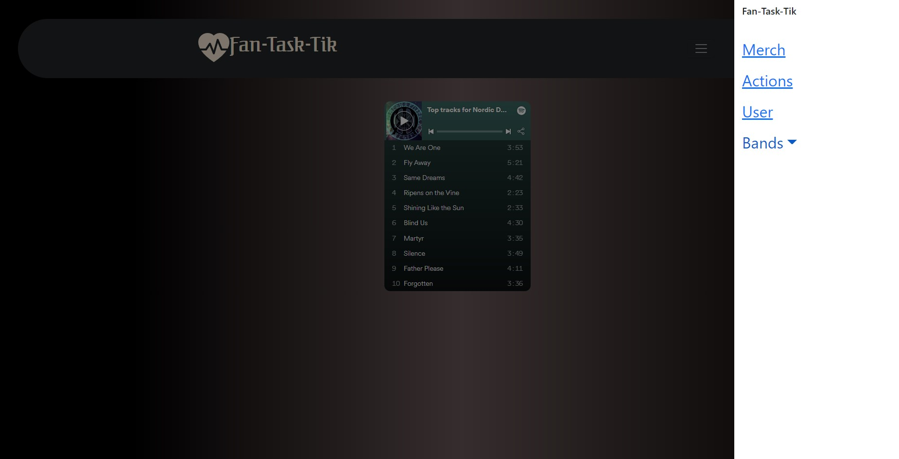

# Fan-Task-Tic
## Table of Contents
----------------------------------------------------------------
- ## [Description](#description)
- ## [Usage](#usage)
- ## [Contributors](#contributors)
- ## [License](#license)
- ## [Links](#links)
----------------------------------------------------------------
## Description
This application will allow users to follow along with their favorite bands. They will be able to stream music, search merchandise and band events, and earn rewards points for purchases and sharing band related posts on social media.

----------------------------------------------------------------
## Usage

[Merchandise Page Screenshot](client/public/images/MerchScreenshot.jpg)

<a href="https://radiant-chamber-41757.herokuapp.com/">Deployed via Heroku</a>

----------------------------------------------------------------
## Contributors

 <a href="https://github.com/MelissaLycan">Melissa Lycan</a>

 <a href="https://github.com/Kmac5000">Keith MacNeil</a>

 <a href="https://github.com/SabotMBT">Joel Rogers</a>

 <a href="https://github.com/SheriB7">Sheri Brown</a>
 
 <a href="https://github.com/wrenvana">Wren Sanchez</a>

----------------------------------------------------------------
## License

This project is licensed under Apache 2.0.

----------------------------------------------------------------
## Links

<a href="https://github.com/MelissaLycan/Fan-Task-Tic">Repository</a>
